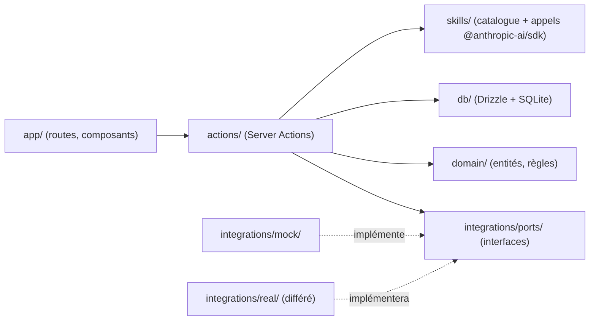
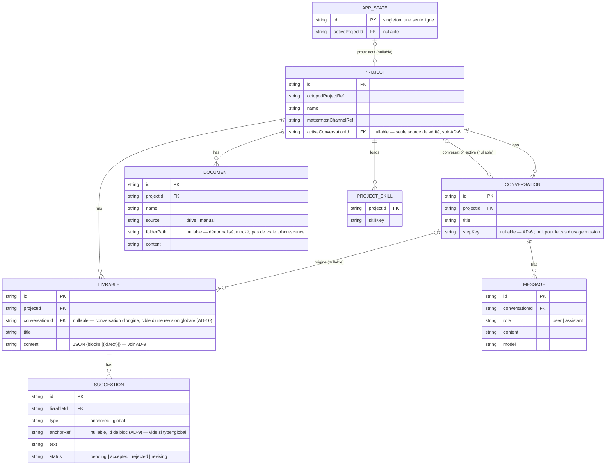

# Architecture Spine — GenAI4Consulting

## Design Paradigm

Monolithe Next.js (App Router) en couches — `app/` (UI) → `actions/` (application) → `domain/` (règles pures) — avec une seule frontière **Ports & Adapters** posée à l'endroit qui bougera : les intégrations OCTO (Octopod, drive, Mattermost). Round 1 = adaptateurs Mock ; un adaptateur réel se branche plus tard sans toucher au reste (AD-1).



## Invariants & Rules

### AD-1 — Frontière Ports & Adapters sur les intégrations OCTO

- **Binds:** FR-2, FR-3, FR-4, FR-5, FR-6
- **Prevents:** du code métier qui appelle directement une API Octopod/drive/Mattermost (mockée ou non), rendant le passage au réel une réécriture plutôt qu'un remplacement d'adaptateur.
- **Rule:** `actions/` et `domain/` n'accèdent à Octopod/drive/Mattermost qu'au travers des interfaces `ProjectProvider`, `DriveProvider`, `MattermostProvider` définies dans `integrations/ports/`. Round 1 n'injecte que `integrations/mock/*`. Aucun accès direct à un adaptateur concret ailleurs que dans le point de câblage (`integrations/index.ts`). Un document ajouté manuellement (FR-4) n'est PAS une donnée Octopod : il ne passe par aucun port, `actions/document.ts` l'écrit directement en base.

### AD-2 — Mutation exclusivement par Server Actions

- **Binds:** all
- **Prevents:** un composant React qui importe le client DB ou un provider directement, créant un deuxième chemin de mutation que `actions/` ne voit pas.
- **Rule:** Seuls les fichiers de `actions/` importent `db/` et `integrations/`. Les composants (`app/`, `components/`) appellent une Server Action ; ils ne lisent la base qu'au travers d'une fonction exposée par `actions/` ou `domain/`. Un handler d'outil dans `skills/` ne mute jamais la base : il retourne son résultat à l'action appelante, seule habilitée à persister.

### AD-3 — Suggestions générées à l'écriture, jamais à la lecture

- **Binds:** FR-19, FR-20, FR-24
- **Prevents:** un futur appel IA déclenché à l'ouverture de l'éditeur, qui casserait l'affichage perçu comme immédiat (FR-24) et le climax d'UJ-1 (les suggestions doivent déjà être là).
- **Rule:** Les suggestions ancrées sont produites par l'agent dans le même appel outil qui crée ou modifie le contenu d'un livrable (`propose_livrable_content` — voir `skills/`), et persistées avant que la réponse ne soit renvoyée à l'UI. Ouvrir l'Éditeur assisté ne fait qu'un `SELECT` — jamais d'appel à `@anthropic-ai/sdk`.

### AD-4 — Skill = catalogue code, chargement = table de jointure

- **Binds:** FR-11
- **Prevents:** une skill stockée en base de données à contenu libre, dont deux implémentations futures du mécanisme d'ajout (OQ-6 du PRD, différé) pourraient diverger sur la forme ; deux skills définissant chacune un outil du même nom avec des schémas incompatibles une fois chargées sur le même projet.
- **Rule:** Chaque skill est une constante TypeScript dans `skills/catalog.ts` (clé stable, instructions, outil `@anthropic-ai/sdk` associé le cas échéant). Le nom de tout outil qu'une skill expose est préfixé par sa `skillKey` (`${skillKey}.${toolName}`) — deux skills ne peuvent jamais définir le même nom d'outil. `project_skill` ne stocke que `(projectId, skillKey)`, avec une contrainte unique sur cette paire (pas de doublon de chargement). Le mécanisme qui alimente cette table (UI d'ajout, découverte automatique...) est différé — voir Deferred.

### AD-5 — Domaine pur, sans I/O

- **Binds:** all
- **Prevents:** une règle métier (ex. transitions d'état d'une suggestion) dupliquée différemment dans une Server Action et dans un composant, parce qu'elle n'a pas de foyer unique.
- **Rule:** `domain/` ne importe ni `db/`, ni `integrations/`, ni `actions/`, ni React. Toute transition d'état (suggestion, stepper) est une fonction pure dans `domain/`, appelée par `actions/` qui seule persiste le résultat.

### AD-6 — Une conversation par étape de workflow, une conversation active explicite

- **Binds:** FR-1, FR-16, FR-17, FR-18
- **Prevents:** un stepper qui "change le contexte de la conversation" sans qu'aucun champ ne relie une étape à une conversation précise ; un champ `activeStepKey` surchargé entre "rien n'est sélectionné" et "une conversation libre (mission, sans étape) est ouverte", qui forcerait deux implémentations à deviner différemment ce que `null` signifie.
- **Rule:** `CONVERSATION.stepKey` (nullable) rattache une conversation à une étape fixe du stepper avant-vente ; contrainte unique sur `(projectId, stepKey)` quand `stepKey` n'est pas nul — une seule conversation par étape et par projet. `PROJECT.activeConversationId` (nullable FK) est la seule source de vérité sur ce qui est affiché — jamais dérivé d'un champ d'étape. Cliquer une étape trouve-ou-crée sa conversation et met à jour `activeConversationId` ; le stepper affiché se lit depuis `activeConversation.stepKey`, jamais l'inverse. Le cas d'usage "livrable de mission" (FR-15) crée une conversation avec `stepKey = null` — un `activeConversationId` valide pointant vers une conversation sans étape n'est pas un état ambigu.
- **Rule (projet actif) :** l'application track un seul `APP_STATE.activeProjectId` (ligne singleton) — c'est la seule notion de "session" que round 1 possède, cohérente avec le fonctionnement mono-poste/mono-utilisateur.

### AD-7 — État de la suggestion proactive : côté client, jamais persisté

- **Binds:** FR-17, FR-18
- **Prevents:** une réapparition figée pour toujours après un simple redémarrage du serveur local (round 1 n'a pas de notion de session), si l'état "masquée" était écrit en base.
- **Rule:** L'état masquée/acceptée d'une suggestion proactive vit en mémoire côté client (state React), clé par `conversationId`. Un rechargement de page = nouvelle session = état réinitialisé, ce qui satisfait naturellement "ne réapparaît pas dans la même conversation" (le state survit tant que la page ne recharge pas) et "peut réapparaître dans une nouvelle session" (elle est perdue au rechargement) sans champ DB ni notion de session à construire. La "suggestion proactive" n'est jamais une ligne de la table `SUGGESTION` — c'est un texte généré à la volée par `skills/propose_starting_point.ts`, sans persistance ; ne pas confondre les deux dans le code.

### AD-8 — Une seule surface flottante ouverte à la fois

- **Binds:** FR-11 (ajout de skill), FR-21 (retravailler)
- **Prevents:** deux fonctionnalités construites indépendamment (ajout de skill, champ de retravail) qui géreraient chacune leur propre `isOpen` local, aboutissant à deux surfaces empilées en même temps — la contrainte "pas de pile de modale à plus d'un niveau" (`EXPERIENCE.md`) n'est alors pas mécaniquement garantie.
- **Rule:** Un unique `OverlayProvider` (client, racine de `app/`) expose `openOverlay(id)` / `closeOverlay()`. Ouvrir une surface flottante ferme automatiquement la précédente. Aucun composant ne détient son propre booléen `isOpen` pour une surface plein-écran ou superposée. Portée du terme "surface flottante" : tout ce qui se superpose visuellement au contenu (menu déroulant, champ de retravail, point d'entrée d'ajout de skill) — pas les expansions inline (ex. un panneau qui s'agrandit dans le flux normal).

### AD-9 — Le contenu d'un livrable est une liste de blocs à identifiant stable

- **Binds:** FR-19, FR-20, FR-21, FR-22
- **Prevents:** un livrable stocké en texte brut/markdown, où "accepter une suggestion" n'aurait aucune cible fiable — un paragraphe inséré plus haut décale tout ce qui suit, et un `anchorRef` par position (index) pointerait alors sur le mauvais texte.
- **Rule:** `LIVRABLE.content` est un JSON `{ blocks: [{ id, text }] }` — chaque bloc (paragraphe) a un `id` stable (`crypto.randomUUID()`), assigné à la création et jamais réutilisé pour un autre texte. `SUGGESTION.anchorRef` (quand `type = 'anchored'`) référence un `id` de bloc, jamais une position. Accepter une suggestion ancrée remplace le texte du bloc ciblé ; l'ordre des autres blocs n'affecte jamais la résolution de l'ancre.

### AD-10 — Révision globale : décidée, pas différée

- **Binds:** FR-23
- **Prevents:** deux implémentations qui inventeraient chacune un canal de retour différent pour une fonctionnalité pourtant dans le scope round 1 du PRD (contrairement à ce qu'un item "Deferred" laisserait penser).
- **Rule:** Une demande de révision globale est postée comme message utilisateur dans `LIVRABLE.conversationId` (jamais une nouvelle conversation). L'agent y répond en ré-invoquant le même outil qu'AD-3 (`propose_livrable_content`), qui met à jour `LIVRABLE.content` et régénère les suggestions ancrées concernées. Seule la formulation exacte du message de retour reste ouverte (copie UI, hors architecture).

### AD-11 — Assemblage de l'appel Messages API

- **Binds:** FR-6, FR-7, FR-11, FR-12
- **Prevents:** deux Server Actions qui construiraient différemment le prompt système (skills combinées comment ? dans quel ordre ?) ou l'historique envoyé au modèle, produisant un comportement d'agent incohérent selon quelle action a été touchée en premier.
- **Rule:** Un seul point d'assemblage (`skills/buildRequest.ts`) construit chaque appel `@anthropic-ai/sdk` : le prompt système concatène les instructions des skills chargées sur le projet (`project_skill`, dans l'ordre de chargement) ; l'historique est la liste ordonnée des `MESSAGE` de la conversation active ; le modèle est celui choisi dans le composer pour ce message (FR-12), jamais un modèle par défaut caché ailleurs.

## Consistency Conventions

| Concern | Convention |
| --- | --- |
| Naming (entités, fichiers, identifiants) | Code (tables, champs, fonctions, types) en anglais ; toute chaîne visible par l'utilisateur en français, jamais codée en dur hors de `components/` (voir `DESIGN.md`/`EXPERIENCE.md` pour le texte exact). |
| Identifiants | `crypto.randomUUID()`, clés primaires texte. Pas d'auto-incrément exposé. |
| État d'une suggestion | Enum unique `pending \| accepted \| rejected \| revising`, défini une fois dans `domain/suggestion.ts`, jamais redéfini ailleurs (UI et DB partagent le même type). |
| Erreurs des Server Actions | Retour `{ ok: true, data } \| { ok: false, error }` — jamais d'exception non attrapée remontant à l'UI. |
| Config / secrets | `ANTHROPIC_API_KEY` en variable d'environnement (`.env.local`, non commité) ; aucun autre secret pour round 1 (pas d'auth). |
| Unicité suggestion active | Index unique partiel SQLite `(livrableId, anchorRef) WHERE status = 'pending' AND type = 'anchored'` — une seule suggestion en attente par paragraphe (FR-20). Les suggestions `global` (`anchorRef` nul) n'ont pas cette contrainte : plusieurs révisions globales en attente restent possibles, NULL n'étant jamais égal à NULL dans un index SQLite. |

## Stack

| Name | Version |
| --- | --- |
| Next.js (App Router, Turbopack) | 16.x |
| React | 19.x |
| TypeScript | 5.7.x (pas TS 7 — rupture de compatibilité avec l'outillage Drizzle actuel) |
| Drizzle ORM + `node:sqlite` (driver natif Node, pas better-sqlite3) | current |
| @anthropic-ai/sdk (Messages API) | 0.124.x+ |
| Node.js | 24 LTS |

## Structural Seed



```text
genai4consulting/
  app/                      # routes App Router — Espace de travail, Éditeur assisté
  components/               # UI partagée, tokens DESIGN.md
  actions/                  # Server Actions — un cluster par feature du PRD (§4)
  domain/                   # entités + règles pures (suggestion, stepper)
  skills/                   # catalogue de skills + appels @anthropic-ai/sdk
  integrations/
    ports/                  # ProjectProvider, DriveProvider, MattermostProvider
    mock/                   # adaptateurs round 1
  db/                       # schéma Drizzle + client SQLite
```

## Capability → Architecture Map

| Feature (PRD §4) | Lives in | Governed by |
| --- | --- | --- |
| 4.1 Connexion à un projet Octopod | `actions/project.ts`, `integrations/mock/*` | AD-1 |
| 4.2 Espace de travail multi-agents | `actions/conversation.ts`, `skills/` | AD-2, AD-4 |
| 4.3 Orchestrateur de workflow | `domain/workflow.ts`, `actions/conversation.ts` | AD-5 |
| 4.4 Éditeur assisté par IA | `actions/livrable.ts`, `actions/suggestion.ts`, `domain/suggestion.ts`, `skills/propose_livrable_content.ts` | AD-3, AD-5, AD-8 |

## Deferred

- **Intégration réelle Octopod/drive/Mattermost** — `integrations/real/*` n'existe pas ; à construire une fois le round 1 validé (PRD, MVP §6.2). AD-1 garantit que ce sera un ajout, pas une réécriture.
- **Mécanisme d'ajout d'une skill** (OQ-6 du PRD) — la forme de stockage est fixée (AD-4), pas l'interface qui l'alimente.
- **Méthode de qualification avant-vente et source de données références/experts** (OQ-1, OQ-2 du PRD) — n'affectent pas la forme des données actuelles (`skills/catalog.ts` reste le point d'extension), mais leur contenu réel n'est pas écrit.
- **Workflow du cas "livrable de mission"** (OQ-3) — `CONVERSATION.stepKey` reste `null` pour ce cas d'usage ; pas de modélisation dédiée tant que ce n'est pas tranché.
- **Copie exacte du message de retour de révision globale** — le mécanisme est décidé (AD-10) ; seule la formulation UI reste ouverte.
- **Auth, multi-utilisateur, déploiement** — round 1 est mono-poste, mono-utilisateur, sans serveur à déployer (décision explicite avec l'utilisateur). Toute l'enveloppe opérationnelle multi-poste est hors scope de cette spine, pas seulement non prioritaire. Corollaire : FR-9/FR-10 (confidentialité de la conversation, partage des livrables avec "le reste de l'équipe projet") n'ont aucun mécanisme d'application ici, faute de notion d'utilisateur — à construire (probablement un champ `ownerId` sur `CONVERSATION`) quand une version multi-poste sera envisagée.
- **Tests automatisés, CI** — non abordés ; à réintroduire si le projet dépasse le stade round 1.
