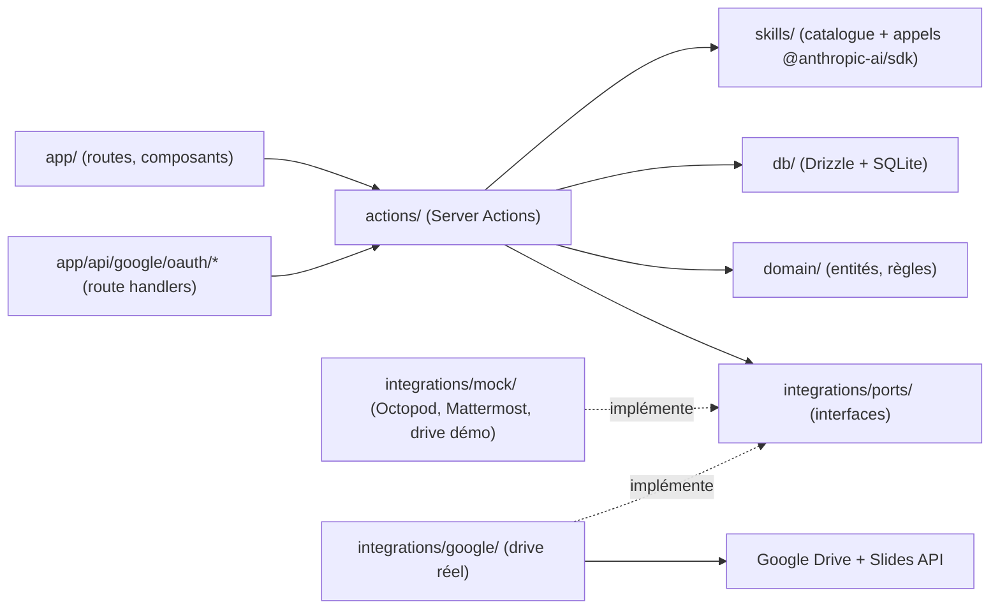
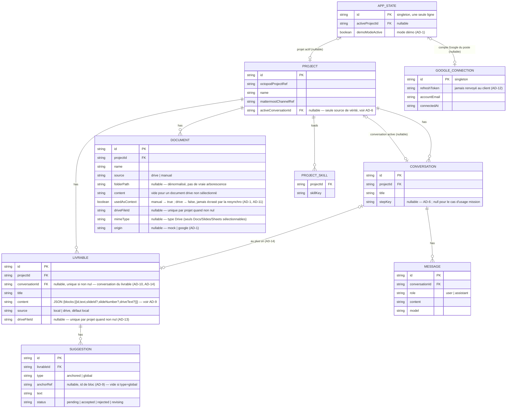

# Architecture Spine — GenAI4Consulting

## Design Paradigm

Monolithe Next.js (App Router) en couches — `app/` (UI) → `actions/` (application) → `domain/` (règles pures) — avec une seule frontière **Ports & Adapters** posée à l'endroit qui bougera : les intégrations OCTO (Octopod, drive, Mattermost). Octopod et Mattermost restent sur des adaptateurs Mock ; le drive a un adaptateur Google réel à côté de son Mock, choisi par mode (AD-1).


```mermaid
graph LR
  UI["app/ (routes, composants)"] --> ACT["actions/ (Server Actions)"]
  ACT --> DOM["domain/ (entités, règles)"]
  ACT --> PORTS["integrations/ports/ (interfaces)"]
  ACT --> DB["db/ (Drizzle + SQLite)"]
  ACT --> SKILLS["skills/ (catalogue + appels @anthropic-ai/sdk)"]
  MOCK["integrations/mock/ (Octopod, Mattermost, drive démo)"] -.implémente.-> PORTS
  GOOGLE["integrations/google/ (drive réel)"] -.implémente.-> PORTS
  GOOGLE --> GAPI["Google Drive + Slides API"]
  OAUTH["app/api/google/oauth/* (route handlers)"] --> ACT
```

## Invariants & Rules

### AD-1 — Frontière Ports & Adapters sur les intégrations OCTO

- **Binds:** FR-2, FR-3, FR-4, FR-5, FR-6, FR-25, FR-26, FR-27, FR-28
- **Prevents:** du code métier qui appelle directement une API Octopod/drive/Mattermost/Google (mockée ou non) ; deux endroits qui choisiraient chacun l'adaptateur drive selon leurs propres critères ; deux stories qui listeraient chacune le dossier Drive à leur façon ; `integrations/` qui lirait la base (AD-2).
- **Rule:** `actions/` et `domain/` n'accèdent à Octopod/drive/Mattermost qu'au travers des interfaces `ProjectProvider`, `DriveProvider`, `MattermostProvider` définies dans `integrations/ports/`. Octopod et Mattermost n'injectent que `integrations/mock/*`.
- **Rule (drive) :** le `DriveProvider` expose `listFiles(projectName)`, `exportText(fileId)`, `readPresentation(fileId)`, `writePresentationText(fileId, edits, requiredRevisionId)`, `createPresentation(projectName, title, slides)`, tous à résultat typé `{ ok: true, data } | { ok: false, error: DriveError }` avec `DriveError` ∈ `unconfigured | disconnected | folder_missing | folder_duplicate | token_revoked | not_found | revision_conflict | quota | unknown`. La résolution du dossier projet (nom exact sous `GOOGLE_DRIVE_ROOT_FOLDER_ID`, jamais créé) vit dans l'adaptateur. Deux adaptateurs : `integrations/google/*` et `integrations/mock/*`. Une seule fonction de `actions/` (`resolveDriveMode`) calcule le mode drive, dans cet ordre de priorité : `demo` (mode démo actif) → mock, panneau Contexte seulement ; `unconfigured` (pas de dossier racine) ; `disconnected` (pas de `GOOGLE_CONNECTION`) → aucune donnée drive ; `connected` → google, avec les identifiants passés par la fabrique de `integrations/index.ts`, seul point de câblage. Hors `connected`, Réimporter / Enregistrer / Créer sont indisponibles ; un livrable drive déjà importé reste consultable et ses suggestions traitables. `token_revoked` fait supprimer `GOOGLE_CONNECTION` par `actions/` (retour à `disconnected`). Une erreur Google n'est jamais renvoyée brute au client.
- **Rule (fichiers du dossier) :** une seule fonction de `actions/` resynchronise les fichiers du dossier pour les panneaux Contexte et Livrables (sync-then-read) : elle met à jour nom, type et date, supprime les lignes de l'`origin` courante dont le fichier a disparu de Drive, conserve les lignes d'une autre `origin` (texte et sélection compris) sans jamais les afficher ni les envoyer tant que l'autre mode est actif (filtre par `origin` à chaque lecture), et ne touche jamais `content` ni `usedAsContext`. *(Amendé le 2026-10-05 : ces lignes étaient purgées ; elles sont conservées pour qu'un aller-retour par le mode démo ne perde pas les choix du consultant.)* `exportText` n'est appelé que pour un document `usedAsContext`, à sa sélection puis au chargement du projet (Google Sheets : CSV de la première feuille ; export plafonné à 10 Mo par Google).
- **Rule (hors-drive) :** un document ajouté manuellement (FR-4) n'est PAS une donnée Octopod ni drive : il ne passe par aucun port, `actions/document.ts` l'écrit directement en base.

### AD-2 — Mutation exclusivement par Server Actions

- **Binds:** all
- **Prevents:** un composant React qui importe le client DB ou un provider directement, créant un deuxième chemin de mutation que `actions/` ne voit pas.
- **Rule:** Seuls les fichiers de `actions/` importent `db/` et `integrations/`. Les composants (`app/`, `components/`) appellent une Server Action ; ils ne lisent la base qu'au travers d'une fonction exposée par `actions/` ou `domain/`. Un handler d'outil dans `skills/` ne mute jamais la base : il retourne son résultat à l'action appelante, seule habilitée à persister.

### AD-3 — Suggestions générées à l'écriture, jamais à la lecture

- **Binds:** FR-19, FR-20, FR-24
- **Prevents:** un futur appel IA déclenché à l'ouverture de l'éditeur, qui casserait l'affichage perçu comme immédiat (FR-24) et le climax d'UJ-1 (les suggestions doivent déjà être là).
- **Rule:** Les suggestions ancrées sont produites par l'agent dans le même appel outil qui crée ou modifie le contenu d'un livrable (`propose_livrable_content` — voir `skills/`), et persistées avant que la réponse ne soit renvoyée à l'UI. Pour un livrable adossé à Drive, elles sont produites à la demande du consultant par l'outil dédié d'AD-13, jamais à l'import ni à l'ouverture. Ouvrir l'Éditeur assisté ne fait qu'un `SELECT` — jamais d'appel à `@anthropic-ai/sdk`.

### AD-4 — Skill = catalogue code, chargement = table de jointure

- **Binds:** FR-11
- **Prevents:** une skill stockée en base de données à contenu libre, dont deux implémentations futures du mécanisme d'ajout (OQ-6 du PRD, différé) pourraient diverger sur la forme ; deux skills définissant chacune un outil du même nom avec des schémas incompatibles une fois chargées sur le même projet.
- **Rule:** Chaque skill est une constante TypeScript dans `skills/catalog.ts` (clé stable, instructions, outil `@anthropic-ai/sdk` associé le cas échéant). Le nom de tout outil qu'une skill expose est préfixé par sa `skillKey` (`${skillKey}__${toolName}` — l'API Messages n'accepte que `[a-zA-Z0-9_-]` dans un nom d'outil) — deux skills ne peuvent jamais définir le même nom d'outil. `project_skill` ne stocke que `(projectId, skillKey)`, avec une contrainte unique sur cette paire (pas de doublon de chargement). Le mécanisme qui alimente cette table (UI d'ajout, découverte automatique...) est différé — voir Deferred.

### AD-5 — Domaine pur, sans I/O

- **Binds:** all
- **Prevents:** une règle métier (ex. transitions d'état d'une suggestion) dupliquée différemment dans une Server Action et dans un composant, parce qu'elle n'a pas de foyer unique.
- **Rule:** `domain/` ne importe ni `db/`, ni `integrations/`, ni `actions/`, ni React. Toute transition d'état (suggestion, stepper) est une fonction pure dans `domain/`, appelée par `actions/` qui seule persiste le résultat.

### AD-6 — Une conversation par étape de workflow, une conversation active explicite

- **Binds:** FR-1, FR-16, FR-17, FR-18
- **Prevents:** un stepper qui "change le contexte de la conversation" sans qu'aucun champ ne relie une étape à une conversation précise ; un champ `activeStepKey` surchargé entre "rien n'est sélectionné" et "une conversation libre (mission, sans étape) est ouverte", qui forcerait deux implémentations à deviner différemment ce que `null` signifie.
- **Rule:** `CONVERSATION.stepKey` (nullable) rattache une conversation à une étape fixe du stepper avant-vente ; contrainte unique sur `(projectId, stepKey)` quand `stepKey` n'est pas nul — une seule conversation par étape et par projet. `PROJECT.activeConversationId` (nullable FK) est la seule source de vérité sur ce qui est affiché — jamais dérivé d'un champ d'étape. Cliquer une étape trouve-ou-crée sa conversation et met à jour `activeConversationId` ; le stepper affiché se lit depuis `activeConversation.stepKey`, jamais l'inverse. Le cas d'usage "livrable de mission" (FR-15) crée une conversation avec `stepKey = null` — un `activeConversationId` valide pointant vers une conversation sans étape n'est pas un état ambigu.
- **Rule (projet actif) :** l'application track un seul `APP_STATE.activeProjectId` (ligne singleton) — c'est la seule notion de "session" que round 1 possède, cohérente avec le fonctionnement mono-poste/mono-utilisateur.

### AD-7 — État de la suggestion proactive : côté client, jamais persisté

- **Binds:** FR-17, FR-18
- **Prevents:** une réapparition figée pour toujours après un simple redémarrage du serveur local (round 1 n'a pas de notion de session), si l'état "masquée" était écrit en base.
- **Rule:** L'état masquée/acceptée d'une suggestion proactive vit en mémoire côté client (state React), clé par `conversationId`. Un rechargement de page = nouvelle session = état réinitialisé, ce qui satisfait naturellement "ne réapparaît pas dans la même conversation" (le state survit tant que la page ne recharge pas) et "peut réapparaître dans une nouvelle session" (elle est perdue au rechargement) sans champ DB ni notion de session à construire. La "suggestion proactive" n'est jamais une ligne de la table `SUGGESTION` — c'est un texte généré à la volée par `skills/propose_starting_point.ts`, sans persistance ; ne pas confondre les deux dans le code.

### AD-8 — Une seule surface flottante ouverte à la fois

- **Binds:** FR-11 (ajout de skill), FR-21 (retravailler)
- **Prevents:** deux fonctionnalités construites indépendamment (ajout de skill, champ de retravail) qui géreraient chacune leur propre `isOpen` local, aboutissant à deux surfaces empilées en même temps — la contrainte "pas de pile de modale à plus d'un niveau" (`EXPERIENCE.md`) n'est alors pas mécaniquement garantie.
- **Rule:** Un unique `OverlayProvider` (client, racine de `app/`) expose `openOverlay(id)` / `closeOverlay()`. Ouvrir une surface flottante ferme automatiquement la précédente. Aucun composant ne détient son propre booléen `isOpen` pour une surface plein-écran ou superposée. Portée du terme "surface flottante" : tout ce qui se superpose visuellement au contenu (menu déroulant, champ de retravail, point d'entrée d'ajout de skill) — pas les expansions inline (ex. un panneau qui s'agrandit dans le flux normal).

### AD-9 — Le contenu d'un livrable est une liste de blocs à identifiant stable

- **Binds:** FR-19, FR-20, FR-21, FR-22, FR-29
- **Prevents:** un livrable stocké en texte brut/markdown, où "accepter une suggestion" n'aurait aucune cible fiable — un paragraphe inséré plus haut décale tout ce qui suit, et un `anchorRef` par position (index) pointerait alors sur le mauvais texte ; une présentation importée dont les blocs ne retrouveraient plus leur zone de texte d'origine à l'enregistrement.
- **Rule:** `LIVRABLE.content` est un JSON `{ blocks: [{ id, text, slideId?, slideNumber?, driveText? }] }` — chaque bloc (paragraphe) a un `id` stable, jamais réutilisé pour un autre texte : `crypto.randomUUID()` pour un livrable local ; pour un livrable adossé à Slides, `id` = `objectId` Slides de la zone de texte (y compris dans un groupe d'éléments), `slideId` = `objectId` de sa diapositive, `slideNumber` = rang de cette diapositive dans la présentation (diapositives sans texte comprises), et `driveText` = dernier texte connu de Drive pour cette zone (AD-13). Tableaux, images et notes du présentateur ne deviennent pas des blocs. `SUGGESTION.anchorRef` (quand `type = 'anchored'`) référence un `id` de bloc, jamais une position. Accepter une suggestion ancrée remplace le texte du bloc ciblé ; l'ordre des autres blocs n'affecte jamais la résolution de l'ancre.

### AD-10 — Révision globale : décidée, pas différée

- **Binds:** FR-23
- **Prevents:** deux implémentations qui inventeraient chacune un canal de retour différent pour une fonctionnalité pourtant dans le scope round 1 du PRD (contrairement à ce qu'un item "Deferred" laisserait penser).
- **Rule:** Une demande de révision globale est postée comme message utilisateur dans `LIVRABLE.conversationId` (jamais une nouvelle conversation). L'agent y répond en ré-invoquant le même outil qu'AD-3 (`propose_livrable_content`), qui met à jour `LIVRABLE.content` et régénère les suggestions ancrées concernées. Sur un livrable adossé à Drive, l'agent n'a que l'outil dédié d'AD-13 : la révision produit des suggestions ancrées, jamais un document régénéré. Seule la formulation exacte du message de retour reste ouverte (copie UI, hors architecture).

### AD-11 — Assemblage de l'appel Messages API

- **Binds:** FR-4, FR-6, FR-7, FR-11, FR-12, FR-20, FR-27
- **Prevents:** deux Server Actions qui construiraient différemment le prompt système (skills combinées comment ? dans quel ordre ? quels documents ?) ou l'historique envoyé au modèle ; un fichier Drive envoyé au modèle IA sans que le consultant l'ait choisi, après déconnexion, ou deux fois.
- **Rule:** Un seul point d'assemblage (`skills/buildRequest.ts`) construit chaque appel `@anthropic-ai/sdk`. Il ne lit jamais la base (AD-2) : l'action appelante lui transmet tout. Le prompt système concatène, dans cet ordre : les instructions des skills chargées sur le projet (`project_skill`, ordre de chargement) ; les documents de contexte — tout `DOCUMENT` avec `usedAsContext = true` (`manual` : vrai à la création ; `drive` : seulement sur sélection, et seulement si son `origin` correspond au mode drive courant), sauf le fichier Drive du livrable de la conversation —, chacun tronqué à 30 000 caractères et l'ensemble à 60 000 (`domain/document.ts`, `budgetContextDocuments` ; les documents au-delà sont signalés comme non fournis), troncature signalée dans le texte ; puis, si la conversation a un livrable (AD-14), son contenu avec les `id` de blocs. L'historique est la liste ordonnée des `MESSAGE` de la conversation active ; les outils sont ceux choisis par AD-14 ; le modèle est celui choisi dans le composer pour ce message (FR-12), jamais un modèle par défaut caché ailleurs.

### AD-12 — Connexion Google : OAuth côté serveur, jeton jamais exposé

- **Binds:** FR-25, NFR §4.5 (jetons jamais exposés)
- **Prevents:** un jeton Google qui atteint le navigateur ; deux façons de se connecter ou deux emplacements de stockage du jeton ; un route handler qui deviendrait un second chemin de mutation hors d'`actions/`.
- **Rule:** Flux OAuth "authorization code" côté serveur, avec un client OAuth Google Cloud de type "Interne" et le scope `https://www.googleapis.com/auth/drive`. Deux route handlers, `app/api/google/oauth/start` et `app/api/google/oauth/callback` — seule exception assumée à AD-2, car une redirection OAuth ne peut pas être une Server Action — vérifient un paramètre `state` anti-CSRF ; le callback n'écrit le jeton que via une fonction de `actions/google-connection.ts`. Le refresh token vit dans la table singleton `GOOGLE_CONNECTION`, jamais renvoyé au client ; la déconnexion supprime la ligne. Un seul compte connecté par poste.

### AD-13 — Livrable adossé à Drive : import explicite, réécriture contrôlée

- **Binds:** FR-28, FR-29, FR-30, FR-31
- **Prevents:** écraser silencieusement une modification faite dans Google Slides ; un faux conflit dû à un `revisionId` expiré (Google ne le garantit que 24 h) ; une réécriture qui ne retrouve plus la zone d'origine ; deux livrables pour la même présentation ; deux façons de savoir ce qui reste à enregistrer.
- **Rule (import) :** l'import lit la présentation via `readPresentation`, crée le livrable (`source = 'drive'`, `driveFileId`, blocs AD-9 avec `driveText = text`) et sa conversation dédiée (AD-14), et ne modifie jamais le fichier. Une présentation déjà importée sur le projet rouvre son livrable (unicité `(projectId, driveFileId)`). "Réimporter" est une action explicite : elle remplace les blocs par la version Drive et ne conserve une suggestion que si son `anchorRef` existe encore et que le texte Drive de ce bloc n'a pas changé.
- **Rule (enregistrement) :** un bloc est modifié quand `text ≠ driveText` — fonction pure de `domain/`, seule source de l'état du bouton "Enregistrer" et de l'avertissement de réimport. Enregistrer relit la présentation : si le texte distant d'un bloc diffère de son `driveText`, ou si sa zone a disparu, c'est un `revision_conflict` et rien n'est écrit ; sinon `writePresentationText` = Slides `presentations.batchUpdate` avec `writeControl.requiredRevisionId` = le `revisionId` qui vient d'être lu, ne réécrivant que le texte des blocs modifiés (`deleteText` + `insertText` sur la zone `id`). Un refus de révision relance une fois le cycle relire → comparer → écrire. Après succès, `driveText := text` pour les blocs écrits. Les changements non textuels faits dans Slides ne bloquent pas : ils ne sont jamais écrasés.
- **Rule (IA et création) :** sur un livrable `source = 'drive'`, l'agent n'a jamais `propose_livrable_content` (AD-14) : un outil dédié dans `skills/` ne produit que des suggestions ancrées sur des `id` de blocs existants. La création (FR-31) passe par `createPresentation` — Drive `files.create` dans le dossier projet (type présentation Google), puis Slides `batchUpdate` pour le contenu — et enchaîne sur le même import.

### AD-14 — Au plus un livrable par conversation, outils choisis en un seul point

- **Binds:** FR-19, FR-23, FR-29, FR-31
- **Prevents:** une conversation qui aurait deux livrables (laquelle reçoit la révision globale ?) ; un livrable Drive régénéré par `propose_livrable_content`, ses `objectId` remplacés par des UUID ; deux actions qui offriraient à l'agent des outils différents pour la même situation.
- **Rule:** `LIVRABLE.conversationId` est unique quand il n'est pas nul — une conversation a au plus un livrable. Tout livrable Drive, importé ou créé depuis une conversation, reçoit à l'import une nouvelle conversation dédiée, titrée d'après la présentation ; la conversation d'origine d'une création garde son propre livrable éventuel. Les outils offerts à l'agent sont choisis par une seule fonction pure de `domain/`, selon la conversation : sans livrable → `propose_livrable_content` (+ l'outil de proposition de présentation si le mode drive est `connected`) ; livrable local → `propose_livrable_content` ; livrable drive → l'outil de suggestions ancrées seul. `sendToAgent` accepte une liste d'outils et ne traite toujours qu'un `tool_use` par réponse.

## Consistency Conventions

| Concern | Convention |
| --- | --- |
| Naming (entités, fichiers, identifiants) | Code (tables, champs, fonctions, types) en anglais ; toute chaîne visible par l'utilisateur en français, jamais codée en dur hors de `components/` (voir `DESIGN.md`/`EXPERIENCE.md` pour le texte exact). |
| Identifiants | `crypto.randomUUID()`, clés primaires texte. Pas d'auto-incrément exposé. |
| État d'une suggestion | Enum unique `pending \| accepted \| rejected \| revising`, défini une fois dans `domain/suggestion.ts`, jamais redéfini ailleurs (UI et DB partagent le même type). |
| Erreurs des Server Actions | Retour `{ ok: true, data } \| { ok: false, error }` — jamais d'exception non attrapée remontant à l'UI. |
| Config / secrets | Variables d'environnement (`.env.local`, non commité, une copie par poste) : `ANTHROPIC_API_KEY`, `GOOGLE_CLIENT_ID`, `GOOGLE_CLIENT_SECRET`, `GOOGLE_DRIVE_ROOT_FOLDER_ID`. Le refresh token Google vit uniquement en base locale (AD-12). |
| Environnement Google | Projet Google Cloud dans l'organisation Workspace OCTO (condition du client OAuth "Interne", qui exempte de la vérification Google pour le scope restreint `drive` ; un administrateur Workspace peut devoir l'approuver), API Drive et Slides activées, redirect URI `http://localhost:3000/api/google/oauth/callback`, quotas Google par défaut. |
| Erreurs Google | Toujours converties en `DriveError` (AD-1) puis en message français dans `ActionResult` ; le détail brut n'est que loggé côté serveur. |
| Unicité suggestion active | Index unique partiel SQLite `(livrableId, anchorRef) WHERE status = 'pending' AND type = 'anchored'` — une seule suggestion en attente par paragraphe (FR-20). Les suggestions `global` (`anchorRef` nul) n'ont pas cette contrainte : plusieurs révisions globales en attente restent possibles, NULL n'étant jamais égal à NULL dans un index SQLite. |

## Stack

| Name | Version |
| --- | --- |
| Next.js (App Router, Turbopack) | 16.x |
| React | 19.x |
| TypeScript | 5.7.x (pas TS 7 — rupture de compatibilité avec l'outillage Drizzle actuel) |
| Drizzle ORM + `node:sqlite` (driver natif Node, pas better-sqlite3) | 1.0.0-rc.x (seule ligne avec le driver `node-sqlite`) |
| @anthropic-ai/sdk (Messages API) | 0.124.x+ |
| @googleapis/drive | 26.x |
| @googleapis/slides | 10.x |
| google-auth-library | 11.x |
| Node.js | 24 LTS |

## Structural Seed


```mermaid
erDiagram
  APP_STATE |o--o| PROJECT : "projet actif (nullable)"
  PROJECT |o--o| CONVERSATION : "conversation active (nullable)"
  PROJECT ||--o{ CONVERSATION : has
  PROJECT ||--o{ LIVRABLE : has
  PROJECT ||--o{ DOCUMENT : has
  PROJECT ||--o{ PROJECT_SKILL : loads
  APP_STATE |o--o| GOOGLE_CONNECTION : "compte Google du poste (nullable)"
  CONVERSATION ||--o{ MESSAGE : has
  CONVERSATION |o--o| LIVRABLE : "au plus un (AD-14)"
  LIVRABLE ||--o{ SUGGESTION : has

  APP_STATE {
    string id PK "singleton, une seule ligne"
    string activeProjectId FK "nullable"
    boolean demoModeActive "mode démo (AD-1)"
  }
  PROJECT {
    string id PK
    string octopodProjectRef
    string name
    string mattermostChannelRef
    string activeConversationId FK "nullable — seule source de vérité, voir AD-6"
  }
  CONVERSATION {
    string id PK
    string projectId FK
    string title
    string stepKey "nullable — AD-6 ; null pour le cas d'usage mission"
  }
  MESSAGE {
    string id PK
    string conversationId FK
    string role "user | assistant"
    string content
    string model
  }
  DOCUMENT {
    string id PK
    string projectId FK
    string name
    string source "drive | manual"
    string folderPath "nullable — dénormalisé, pas de vraie arborescence"
    string content "vide pour un document drive non sélectionné"
    boolean usedAsContext "manual → true ; drive → false, jamais écrasé par la resynchro (AD-1, AD-11)"
    string driveFileId "nullable — unique par projet quand non nul"
    string mimeType "nullable — type Drive (seuls Docs/Slides/Sheets sélectionnables)"
    string origin "nullable — mock | google (AD-1)"
  }
  PROJECT_SKILL {
    string projectId FK
    string skillKey
  }
  LIVRABLE {
    string id PK
    string projectId FK
    string conversationId FK "nullable, unique si non nul — conversation du livrable (AD-10, AD-14)"
    string title
    string content "JSON {blocks:[{id,text,slideId?,slideNumber?,driveText?}]} — voir AD-9"
    string source "local | drive, défaut local"
    string driveFileId "nullable — unique par projet quand non nul (AD-13)"
  }
  GOOGLE_CONNECTION {
    string id PK "singleton"
    string refreshToken "jamais renvoyé au client (AD-12)"
    string accountEmail
    string connectedAt
  }
  SUGGESTION {
    string id PK
    string livrableId FK
    string type "anchored | global"
    string anchorRef "nullable, id de bloc (AD-9) — vide si type=global"
    string text
    string status "pending | accepted | rejected | revising"
  }
```

```text
genai4consulting/
  app/                      # routes App Router — Espace de travail, Éditeur assisté
  components/               # UI partagée, tokens DESIGN.md
  actions/                  # Server Actions — un cluster par feature du PRD (§4)
  domain/                   # entités + règles pures (suggestion, stepper)
  skills/                   # catalogue de skills + appels @anthropic-ai/sdk
  integrations/
    ports/                  # ProjectProvider, DriveProvider, MattermostProvider
    mock/                   # adaptateurs Octopod, Mattermost, drive (démo)
    google/                 # adaptateur drive réel (Drive + Slides API)
  app/api/google/oauth/     # start + callback (AD-12)
  db/                       # schéma Drizzle + client SQLite
```

## Capability → Architecture Map

| Feature (PRD §4) | Lives in | Governed by |
| --- | --- | --- |
| 4.1 Connexion à un projet Octopod | `actions/project.ts`, `integrations/mock/*` | AD-1 |
| 4.2 Espace de travail multi-agents | `actions/conversation.ts`, `skills/` | AD-2, AD-4 |
| 4.3 Orchestrateur de workflow | `domain/workflow.ts`, `actions/conversation.ts` | AD-5 |
| 4.4 Éditeur assisté par IA | `actions/livrable.ts`, `actions/suggestion.ts`, `domain/suggestion.ts`, `skills/propose_livrable_content.ts` | AD-3, AD-5, AD-8 |
| 4.5 Livrables et contexte Google Drive | `actions/google-connection.ts`, `actions/document.ts`, `actions/livrable.ts`, `actions/message.ts`, `domain/` (blocs modifiés, choix des outils), `integrations/google/*`, `integrations/index.ts`, `app/api/google/oauth/*`, `skills/buildRequest.ts` | AD-1, AD-9, AD-11, AD-12, AD-13, AD-14 |

## Deferred

- **Intégration réelle Octopod/Mattermost** — à construire une fois le round 1 validé (PRD, MVP §6.2). AD-1 garantit que ce sera un ajout d'adaptateur, comme pour le drive.
- **Valeur des plafonds de contexte** (AD-11) — fixée le 2026-10-05 : 30 000 caractères par document, 60 000 au total ; à recalibrer à l'usage.
- **Mise en page et proposition de présentation** (OQ-7 du PRD, FR-31) — `createPresentation` est fixé ; le modèle de diapositives, la forme de la proposition de l'agent et sa persistance jusqu'à validation appartiennent à la seule story de création, à trancher dans sa spec.
- **Migration du code existant vers l'Epic 5** — à faire par les stories qui touchent ces fichiers : port `listDocuments(projectId)` → `listFiles(projectName)` ; `integrations/index.ts` passe de constantes à une fabrique ; resynchro de `actions/document.ts` (écrase `content`, ne purge pas, réutilise l'id du provider comme clé) ; `skills/buildRequest.ts` lisait `demoModeActive` en base (écart préexistant à AD-2 — résolu le 2026-10-05 : le drapeau est passé par l'appelant) ; aucun document de contexte n'est encore envoyé au modèle (FR-4 jamais réalisée) ; la contrainte unique sur `LIVRABLE.conversationId` (AD-14) suppose de vérifier d'abord l'absence de doublons en base (cas résiduel différé depuis la story 4.4).
- **Formats Drive autres que Google Slides, sous-dossiers du dossier projet** — hors round 1 (PRD §6.2, FR-27).
- **Mécanisme d'ajout d'une skill** (OQ-6 du PRD) — la forme de stockage est fixée (AD-4), pas l'interface qui l'alimente.
- **Méthode de qualification avant-vente et source de données références/experts** (OQ-1, OQ-2 du PRD) — n'affectent pas la forme des données actuelles (`skills/catalog.ts` reste le point d'extension), mais leur contenu réel n'est pas écrit.
- **Workflow du cas "livrable de mission"** (OQ-3) — `CONVERSATION.stepKey` reste `null` pour ce cas d'usage ; pas de modélisation dédiée tant que ce n'est pas tranché.
- **Copie exacte du message de retour de révision globale** — le mécanisme est décidé (AD-10) ; seule la formulation UI reste ouverte.
- **Auth, multi-utilisateur, déploiement** — round 1 est mono-poste, mono-utilisateur, sans serveur à déployer (décision explicite avec l'utilisateur) ; la seule authentification est le compte Google du poste (AD-12), un seul à la fois. Toute l'enveloppe opérationnelle multi-poste est hors scope de cette spine, pas seulement non prioritaire. Corollaire : FR-9/FR-10 (confidentialité de la conversation, partage des livrables avec "le reste de l'équipe projet") n'ont aucun mécanisme d'application ici, faute de notion d'utilisateur — à construire (probablement un champ `ownerId` sur `CONVERSATION`) quand une version multi-poste sera envisagée.
- **Tests automatisés, CI** — non abordés ; à réintroduire si le projet dépasse le stade round 1.
